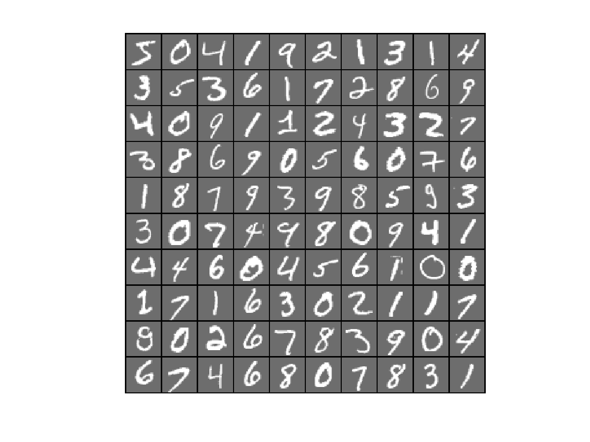

# Convolutional Neural Network
More explanations are available on the [wiki](https://github.com/mnchapel/machine_learning/wiki/Convolutional-Neural-Networks).

## Data
The data used here comes from the [MNIST database](http://yann.lecun.com/exdb/mnist/). This database is composed of handwritten digits with 60,000 examples for the training set and 10,000 for the test set. The image below shows the first 100 images of the MNIST database.

## Results
The neural network was trained on the 60,000 images of the training set and the optimal weights found were saved in the "opt_nn_weights.mat" file. The neural network recognizes handwritten digits with an accuracy of 96.99%.
