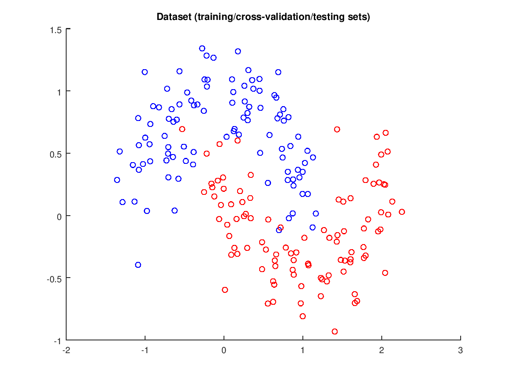
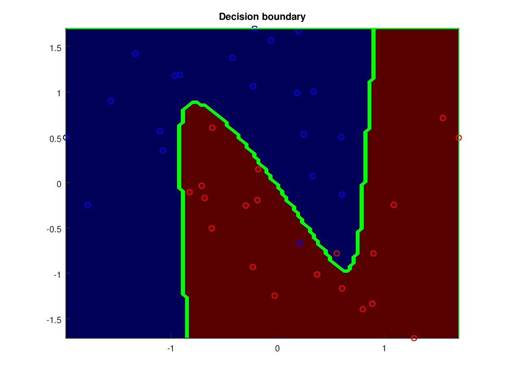

# Feedforward Neural Network
Apply a feedforward neural network to classify 2D points in the blue or the red set.

This dataset was produced with the make_moons python function.

The decision boundary obtained on the test set.
